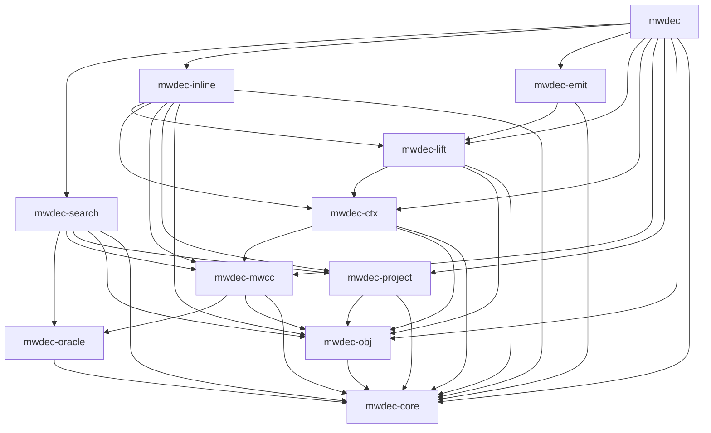

# mwdec architecture

How the crates fit together. The representations, pass order, anti-cheat rules and comparator
are in [DESIGN.md](DESIGN.md).

## Crates

**`mwdec-core`**: shared data types and nothing else: the object model (`ObjectFile`,
`Function`, `Reloc`, `Section`, `DataSymbol`, `SymbolDef`), project records (`Unit`,
`DatasetEntry`), the type model (`Type`, `FuncSig`, `Class`, `Field`, `DeclInfo`, `TypeDb`) and
`CompareResult`. Two small behaviour modules: `paths` (`project_root`, `work_base`, `work_dir`)
and `memcap` (`install`, `stats`, `report_line`). Changes are additive only (add fields or
variants, never rename or remove), since every crate depends on it.

**`mwdec-obj`**: loads MWCC/dtk ELF objects into `ObjectFile` (`load_object`,
`load_object_bytes`), resolving section-symbol relocations to named symbols; lookups
(`find_function`, `data_bytes`, `c_string_at`, `symbol_location`) and disassembly via ppc750cl
(`disassemble`, `disasm_word`).

**`mwdec-project`**: project metadata. `Project::load` reads units from objdiff.json and compiler
flags/versions from build.ninja (`ninja::mwcc_edges`); `Project::dataset` reads report.json;
`split_of`, `size_bucket`, `is_compiler_generated`; module helpers (`module_of`,
`load_module_data` for target objects, `load_module_linked` for objects as linked). `harness`
(`context_tu`, `include_lines`) is eval-harness bookkeeping; `standalone::standalone` decides
whether a function can exist as source at all (header inline, compiler-generated member).

**`mwdec-mwcc`**: the real compiler and the strict comparator. `Mwcc` is a driver bound to a
project root with a bounded process pool: `precompile` (per-unit `.mch` precompiled header),
`plain_context`, `compile_in(&UnitContext, code) -> Compiled`, `compile_many`, `compile_tu`;
`MwccError` separates compile errors, crashes and timeouts. The `split` module works around
compiler crashes with some precompiled headers (`repair`, `uses_split`). `compare`,
`compare_detailed` and `compare_indexed` (with `ObjIndex`, `ExternIndex` for literals defined
in other objects of the module) implement the comparator and return a `DiffClass`. The `fast`
module (`enable_fast`, on for the search drivers) serves `compile_in` from persistent compiler
processes (`mwdec_oracle::persist`) on dedicated worker threads; failures are recompiled
normally, `Compiled::fast` marks such objects and `compile_in_normal` confirms exact matches.

**`mwdec-ctx`**: type context. `build_typedb(context_tu, cflags, work_dir) -> TypeDb`
preprocesses the context, scans declarations (`scan`), compiles forcing declarations with `-g`,
parses DWARF 1.1 (`dwarf`, `convert`) and resolves declarations (`resolve`). Also
`typedb_from_object_bytes`, `vtables_from_object` / `apply_vtables`, layout queries (`field_at`,
`size_of`, `class_of`), `sig_from_mangled`, structured demangling (`mangle`).

**`mwdec-lift`**: PowerPC to structured IR. `lift_function(obj, f, Option<&TypeDb>) ->
IrFunction` (`lift_function_with` + `LiftOptions` to switch off temp folding or `for` loops).
Public modules expose each stage: `insn`, `cfg`, `frame`, `translate::Lifter`, `structure`,
`ir`, `sig` (`sig_of`, `demangle`), the recovery passes, and `debug` (stage dumps with
`MWDEC_DUMP=1`). No compiler, no I/O.

**`mwdec-emit`**: IR to C++ text. `emit_function(&IrFunction, Option<&TypeDb>, &EmitOptions) ->
Emitted { preamble, body }`; helpers `type_str`, `decl`, `referenced_symbols`,
`float::format_float`. Static initializers (`__sinit_*`) are rendered as the global definitions
they come from (`sinit`). Functions the compiler emits on demand (template instances, header
inlines, implicit special members) get instantiation drafts instead (`instantiate::triggers`: an
explicit instantiation, a call, `new`/`delete[]`, an assignment or the function's address).

**`mwdec-inline`**: folds expanded header inlines back into calls. `build_library_for(db,
target, cache, compile) -> InlineLib` generates probes (`probe`), compiles them through the
caller's closure and lifts them into `Template`s; `apply(&mut IrFunction, &InlineLib, &TypeDb)`
matches and rewrites (`matcher`). `ProbeCache` keeps templates on disk across units and runs;
`complete::complete_in` adds layouts of template instances the context only declares;
`session::UnitSession` / `library_for` set up the same inputs for standalone tools.

**`mwdec-oracle`**: compiler experiments and models, independent of the drafter. Library:
`compile::Compiler` + `flags::profile_flags`, `asm` (annotated listings), `variants` (experiment
files with checked expectations), `webs`, `regalloc`, `hints`, `sched`, `schedcheck`, `explain`,
`iro`, `tracer` (the unmodified compiler under a minimal debugger). Binaries: `mwcc-oracle`
(asm / trace / inline / iro front end) and the validators `ra-scan`, `ra-fuzz`, `ra-simplify`,
`ra-spill-scan`, `explain-check`, `sched-alias-check`.

**`mwdec-search`**: the compiler-in-the-loop permuter. `search(&Scorer, init, &SearchConfig) ->
SearchResult` runs a parallel beam / hill-climb over text mutations; `polish` does
match-preserving clean-ups. `Scorer::eval` compiles (via `Mwcc`) and scores (`Fitness`,
`DiffProfile`); `cst` (tree-sitter-cpp arena + edits), `ops` / `structural` / `near` (operators),
`func` (target function and effects model), `locate` (diff localisation), `hints` and `trace`
(compiler-model driven edits, from mwdec-oracle). Binary: `permuter-bench`.

**`mwdec`**: the CLI (`main.rs`) and orchestration: `search_cmds` (`unit_inputs`, `draft`,
`choose_draft`, `cmd_match`, `cmd_eval`, `Compilers`, `ModuleExterns`), `draft_server` (eval's
capped drafting child), `harvest` (`cmd_harvest`, `cmd_verify_units`), `autoctx` (header-only
contexts for units without a source file).

## Dependency graph

From the crates' `[dependencies]` (dev-dependencies of tests/examples not shown):



The same as layers (each layer uses only layers below it):

```
            mwdec (CLI)
     mwdec-search        mwdec-inline
          |              mwdec-emit
          |              mwdec-lift
          |              mwdec-ctx
          |-------- mwdec-mwcc     mwdec-project
     mwdec-oracle         mwdec-obj
                     mwdec-core
```

Two independent stacks meet only in the CLI: the drafter (lift, emit, inline) produces text, the
searcher (search, oracle) consumes text. mwdec-lift uses mwdec-ctx only for
`sig_from_mangled`.

## Data flow of the main commands

In the CLI, the per-unit setup `search_cmds::unit_inputs` is shared by draft, match, eval and
harvest:

1. `mwdec_project::harness::context_tu` (or `autoctx::auto_unit` in harvest) gives the context TU;
2. `Compilers::for_unit` returns a `mwdec_mwcc::Mwcc` for the unit's compiler version;
   `Mwcc::precompile` builds the `.mch` (falls back to `plain_context`);
3. `mwdec_obj::load_object` loads the target object;
4. `mwdec_ctx::build_typedb`, then `vtables_from_object` / `apply_vtables` over the module's
   target objects, then `mwdec_inline::complete::complete_in` (probe compiles);
5. `mwdec_search::trace::Tracer::new` (GC/2.7 units only) and `with_extern_literals`, which
   copies literal values the target references from other objects of the module (through a
   `mwdec_mwcc::ExternIndex`) into the lifter's view of the object.

**draft** (`search_cmds::draft`; also the hidden `draft-server`): `mwdec_lift::sig::sig_of` +
`mwdec_project::standalone::standalone` (refuse header inlines / implicit members) ->
`mwdec_lift::lift_function` -> `InlineLibs::get` (`mwdec_inline::build_library_for`, compiles
missing probes through `Mwcc::compile_in`) -> `mwdec_inline::apply` ->
`mwdec_emit::emit_function` -> `extern_c_definition`. `choose_draft` compiles the variants with
and without folded inlines and keeps the better. In `eval` (unless `--exclude-implicit`) and
`match`, functions classified as header inlines / implicit members, and template instances in
any case, are drafted as instantiations (`instantiation_drafts`, chosen by `choose_among`); only
when none matches is the lifted body tried as an explicit specialization (alone and followed by
a use).

**check** (`cmd_check`): `Project::load` -> `harness::context_tu` -> `Mwcc::precompile` ->
`Mwcc::compile_in` (retry with the plain context after a crash) ->
`mwdec_obj::load_object_bytes` (ours) + `load_object` (target) -> `module_externs`
(`ExternIndex::layered` over `load_module_data` / `load_module_linked`) ->
`mwdec_mwcc::compare_indexed` -> verdict and exit code.

**match** (`cmd_match`): `Project::load` -> `externs_for` -> `unit_inputs` -> draft (or
`--init`) -> `ObjIndex::with_externs` -> `mwdec_search::Scorer::new` -> `choose_draft` ->
`mwdec_search::search` (each candidate: `Scorer::eval` -> `Mwcc::compile_in` ->
`load_object_bytes` -> `score::fitness` -> `compare_indexed`; on new bests `locate::Locator`,
`trace::Tracer`, `hints` from mwdec-oracle) -> `best.cpp` / `result.json`.

**eval** (`cmd_eval`): `Project::dataset` -> filter by split/size/unit/`--list` -> seeded
shuffle -> grouped by unit -> `--jobs` worker threads. Per function: `ModuleExterns::get`
(main module index shared, REL module indexes layered on it) -> `unit_inputs` without a TypeDb
-> `draft_server::DraftClient::draft` (a `mwdec draft-server` child holding the current unit's
TypeDb and inline library) -> `choose_between` -> one `Scorer::eval` before the clock starts ->
`search` -> one JSONL row. Unit inputs are dropped after the unit's last function, module
indexes after the module's; the summary table is printed at the end.

**harvest** (`cmd_harvest`): `supervise` re-runs itself as a child and restarts it after an
abnormal exit -> `candidates` (report.json functions below 100%, non-weak, not
compiler-generated, smallest first, `--scope`) -> `autoctx::HeaderIndex::build` -> per unit
`unit_context` + `unit_inputs_with_context` (LRU of 3 units) -> `draft_with` -> `choose_draft` ->
`search`, falling back to `draft_raw` (raw offsets) when the draft doesn't compile ->
`attempts.jsonl`, `exact.jsonl`, `funcs/`, `miss/`. Attempts are tagged (`--tag`) and resumable.

### Draft variants (`mwdec_lift::variants`)

Some decisions of the lifter and the emitter are not settled by the machine code: a run of member
stores or one whole-object copy, a folded inline or its expansion, a named local or a
temporary, an initializer list or assignments in the body. Rather than guessing, a decision site
asks the variant registry and the compiler picks:

```rust
// at the decision site (anything that runs during lift + inline folding + emit)
if mwdec_lift::variants::alt(mwdec_lift::variants::MY_POINT) { /* alternative */ } else { /* default */ }
```

- Register the point as a `pub const MY_POINT: &str = "area.what"` in `variants.rs` and add it to
  `variants::POINTS` with one line saying what the alternative does. Ask only where the
  alternative would actually change the output (try the rewrite on a copy first).
- Outside a draft, `alt` returns `false` (the default) and records nothing, so tools that call
  lift/emit directly see the default draft.
- The driver (`search_cmds::variant_drafts`) drafts once inside `variants::draft(&[], ..)`, which
  returns the points the draft asked, then redrafts with each asked point flipped (at most
  `MAX_VARIANT_POINTS`, one flip at a time), keeping distinct sources (`DraftReply::variants`
  from the draft server). `eval` / `match` / `harvest` first run the default pipeline (default
  vs plain draft, register repair); only if that is not exact are the variants compiled
  (`search_cmds::repair_or_variant`: best variant, repaired too), and one replaces the default
  only when strictly better, so a variant point can never cost an exact match.
- Cost: one lift + emit per asked point, one compile per distinct variant; nothing for functions
  whose draft asks no point. `MWDEC_NO_VARIANTS=1` turns variants off (ablations).
- Points so far: `structcopy.setters` (member stores into a local from one object's members
  become `v = o`), `structcopy.return_whole` (a returned object filled from one object behind
  flag checks and early returns, e.g. an `optional_object` copy, becomes `return x;`),
  `structcopy.no_temp`, `structcopy.no_return` (keep the member-wise forms `structcopy` would
  rewrite). The older fixed alternatives (folded inlines vs plain, raw offsets, `const`
  static-initializer globals, instantiation drafts) are separate candidates of the same choice.

### Cheap no-loss check (`eval --drafts-only`, `tools/drafts_diff.py`)

A full train eval takes hours under load, but a change to lift/emit only matters where it
changes a draft. `mwdec eval --drafts-only` drafts without compiling (the draft server's lift +
inline folding + emit) and gives every row a `draft_hash` over all draft texts the compile stage
would see (default, plain, raw, alternatives, variants; deterministic).
`python -I tools/drafts_diff.py --base <old mwdec.exe> --new <new mwdec.exe> [--list rows.jsonl]
[--shards 2] [--out dir]` drafts every train <=128 B function (or the list) with both binaries,
sharded by unit, evaluates only the functions whose hash differs with both binaries
(`--budget-secs 0`) and prints gained/lost (exit 1 if anything was lost). `--base-env K=V` /
`--new-env K=V` compare one binary with a feature switched off (`MWDEC_NO_VARIANTS=1`,
`MWDEC_NO_STRUCTCOPY=1`, ...). Changes after drafting (register repair, choice among drafts,
the search) are not visible in the hash: check those on the set of functions they act on.

## Caches

Disk caches are content-addressed (inputs, flags, compiler and a version salt in the key) and
can be deleted at any time. In-memory caches are bounded or scoped to a unit/module and dropped
with it; nothing grows with the number of functions processed.

| cache | owner | where | bound / lifetime |
|---|---|---|---|
| precompiled contexts (`<hash>.mch`) | `Mwcc::precompile` | disk: `<mwcc work>/pch` | one per (compiler, flags, context) |
| split-PCH repairs (`<hash>.split`) | `mwdec_mwcc::split` | disk, next to the PCH | one per context |
| compiled candidates (`<hash>.o` / `.err`) | `Mwcc::compile_in` | disk: `<mwcc work>/cache` | off for search drivers (`Compilers::for_unit` sets `disk_cache = None`); on for `check` and probe drivers |
| compiled candidates | `Mwcc` `MemCache` | memory | byte budget, 96 MB default (`MWDEC_MEMCACHE_MB`), oldest evicted first; per driver |
| parsed contexts (persistent compiler snapshots) | `Mwcc` fast path | memory + one idle compiler process each | at most workers (<= 4) x 2 per driver, LRU per worker; ended with the driver (harvest: 2 workers per unit driver); `MWDEC_PERSIST=0` turns it off |
| TypeDb per context (`<hash>.json.gz`) | `mwdec_ctx::build_typedb_in` | disk: `<work base>/mwdec-ctx/ctxcache` | one per (context, flags, root) |
| inline templates and probe failures | `mwdec_inline::ProbeCache` | disk: `<work base>/mwdec-inline/tcache/<generation>` | keyed by probe text + compiler + flags |
| probe compiles | `Compilers::probe_driver` | disk: `<mwcc work>/inline-probes/<compiler>` | shared across units and runs |
| automatic contexts, header test compiles | `autoctx::HeaderIndex` | disk: `<work base>/harvest/autoctx` | per unit / per header |
| unit inputs (context, PCH handle, TypeDb, inline library) | `search_cmds::UnitInputs` | memory | eval: dropped after the unit's last function; harvest: LRU of 3; eval keeps no TypeDb in the parent |
| module extern indexes | `ModuleExterns` / `externs_for` | memory | main shared; REL modules dropped after their last function (harvest keeps one) |
| seen candidates, focus sets | `mwdec_search::search` | memory | one function's search |

`<mwcc work>` is `--work`, else `$MWDEC_WORK_BASE/mwdec-search/work` for match/eval and
`$MWDEC_WORK` or `$MWDEC_WORK_BASE/mwdec-mwcc` for check and the other commands. Outputs:
`search/<unit>/<symbol>/` (match), `eval/eval_<split>_s<seed>_b<budget>_<pid>.jsonl` plus a
`.runs` directory (eval), `harvest/` (harvest), all under `$MWDEC_WORK_BASE`.

## Memory cap

Every binary (CLI, oracle and search binaries, examples) calls `mwdec_core::memcap::install()`
as the first line of `main`. On Windows it puts the process in a job object with a job-wide
committed-memory limit (`JOB_OBJECT_LIMIT_JOB_MEMORY`), so the compilers it spawns count too and
a runaway allocation fails inside mwdec ("memory allocation of N bytes failed") instead of
exhausting the machine. Elsewhere it is a no-op.

- Limit: `MWDEC_MEM_MB`, default 3072 (`memcap::DEFAULT_MB`). Never set it above 4096 and never
  to 0 (0 disables the cap).
- Hitting the cap is a bug to fix (unbounded cache, memo or IR growth), not a reason to raise
  it.
- Nested caps: eval's drafting child runs at `draft_server::DRAFT_MEM_MB` (1536 MB, or less if
  the parent's cap is lower), so a pathological function becomes an `oom/too-big`, `crash` or
  `timeout` row and the child restarts. Harvest's supervised child likewise restarts after an
  allocation failure.
- Reporting: `memcap::stats` / `report_line` (`eval --mem-report`); every eval row records the
  process commit (`mem_mb`).
- Operating rules: in-memory caches must be bounded (LRU or per-unit) with big caches on disk;
  `eval --jobs` at most 3; one large eval or bench per process tree at a time; cargo builds
  themselves wrapped in a commit cap with `CARGO_BUILD_JOBS=3`.
